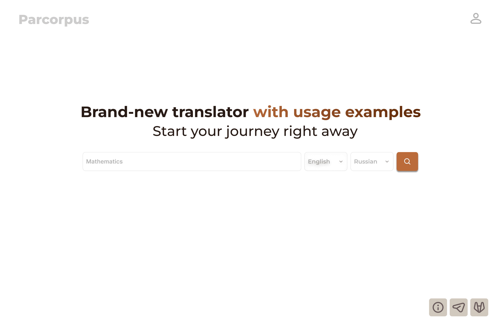

# Frontend for [parcorpus](https://github.com/pauuser/parcorpus) application

This is the frontend application for the Parallel Corpus website, built using React and Typescript.

## Features
- Registration and login
- Use of [GravityUI](https://gravity-ui.com/) components and icons
- Mobile layouts included, **responsive web design**
- Full visualization of backend capabilities
- Use of local storage for forms

## Installation
1. Clone the repository: git clone https://github.com/pauuser/parcorpus-frontend
2. Install dependencies: npm install
3. Start the development server: npm start

## Screens

Screens of the application are available [here](./doc/screens.pdf).